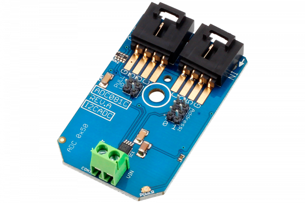

.

# ADC081C
ADC081C is a 8-Bit 1-Channel High-Speed Analog to Digital Converter.
This Device is available from www.ncd.io 

[SKU: ADC081C_I2CS]

(https://store.ncd.io/product/adc081c-8-bit-1-channel-high-speed-analog-to-digital-converter-i2c-mini-module/)
This Sample code can be used with Arduino.

Hardware needed to interface ADC081C 8-Bit 1-Channel High-Speed ADC with Arduino
1. <a href="https://store.ncd.io/product/i2c-shield-for-arduino-nano/">Arduino Nano</a>
2. <a href="https://store.ncd.io/product/i2c-shield-for-arduino-micro-with-i2c-expansion-port/">Arduino Micro</a>
3. <a href="https://store.ncd.io/product/i2c-shield-for-arduino-uno/">Arduino uno</a>
4. <a href="https://store.ncd.io/product/dual-i2c-shield-for-arduino-due-with-modular-communications-interface/">Arduino Due</a>
5. <a href="https://store.ncd.io/product/adc081c-8-bit-1-channel-high-speed-analog-to-digital-converter-i2c-mini-module/">ADC081C 8-Bit 1-Channel High-Speed Analog to Digital Converter</a>
6. <a href="https://store.ncd.io/product/i%C2%B2c-cable/">I2C Cable</a>

ADC081C:
The ADC081C021 is a low-power, monolithic, 8-bit,analog-to-digital converter (ADC) that operates from a +2.7 to 5.5V supply. The converter is based on a successive approximation register architecture with an internal track-and-hold circuit that can handle input frequencies up to 11MHz.
The ADC081C021 operates from a single supply which also serves as the reference. The device features an I2C compatible serial interface that operates in all three speed modes, including high speed mode (3.4MHz).

Applications:

•System monitoring

•Peak detection

•Portable instrument

•Medical instrument

•Test equipements

## Arduino
Download and install Arduino Software (IDE) on your machine. Steps to install Arduino are provided at:

https://www.arduino.cc/en/Main/Software

Download (or git pull) the code and double click the file to run the program.
Compile and upload the code on Arduino IDE and see the output on Serial Monitor.

How to Use the ADC081C Arduino Library
The ADC081C has a number of settings, which can be configured based on user requirements.

1.Automatic Conversion mode: When these bits are set to zeros, the automatic conversion mode is disabled. This is the case at power-up.When these bits are set to a non-zero value, the ADC will begin operating in automatic conversion mode.

    adc.setCycleTime(CYCLE_TIME_32);              // Tconvert x 32, 27 ksps
    
2.Alert Hold:This bit tells the Alert will self clear or not.

   0: Alerts will self-clear when the measured voltage moves within the limits by more than the hysteresis register value.
  
   1: Alerts will not self-clear and are only cleared when a one is written to the alert high flag or the alert low flag in the Alert Status register.

    adc.setAlertHold(ALERT_HOLD_CLEAR);         // Alerts will self-clear

3.Alert Flag Enable:This bit indicates when an alert condition has occurred. When the Alert Bit Enable is set in the Configuration Register, this bit will be high if either alert flag is set in the Alert Status Register.Otherwise, this bit is a zero.

   0: Disables alert status bit [D15] in the Conversion Result register.
  
   1: Enables alert status bit [D15] in the Conversion Result register.

       adc.setAlertFlag(ALERT_FLAG_DISABLE);     // Disables alert status bit in the Conversion Result register
       
4.Alert Pin Enable:.

   0: Disables the ALERT output pin. The ALERT output will TRI-STATE when the pin is disabled.
  
   1: Enables the ALERT output pin
  
    adc.setAlertPin(ALERT_PIN_DISABLE);       // Disables the ALERT output pin

5.Polarity: This bit configures the active level polarity of the ALERT output pin.

   0: Sets the ALERT pin to active low.
 
   1: Sets the ALERT pin to active high
 
     adc.setPolarity(POLARITY_LOW);        // Sets the ALERT pin to active low
    
6.Voltage measurement:The following command is used to measure the output voltage.

    raw_adc = adc.Measure_Voltage();      // read the output voltage

